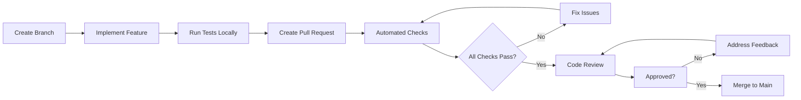

# GitHub Code Review Process Setup

This document outlines the comprehensive code review process configured for the appointment booking system monorepo.

## Overview

The code review process is designed to ensure:
- **Code Quality**: Consistent standards and best practices
- **Security**: Proper validation and protection mechanisms
- **Performance**: Efficient implementations and optimizations
- **Maintainability**: Clear, documented, and testable code
- **Collaboration**: Knowledge sharing and team alignment

## 🚀 Features Implemented

### 1. Automated Code Quality Gates
- **TypeScript compilation** for all packages
- **ESLint/Prettier** formatting checks
- **Unit and integration tests** with coverage
- **Security scanning** with npm audit and CodeQL
- **Build validation** for all affected packages

### 2. Intelligent Review Assignment
- **Package-based reviewer assignment** based on changed files
- **Automatic reviewer requests** on PR creation
- **CODEOWNERS file** for ownership enforcement
- **Team-based reviews** for different expertise areas

### 3. PR Quality Controls
- **PR template** with comprehensive checklist
- **Size and complexity analysis** with warnings
- **Milestone assignment** verification
- **Issue linking** requirements
- **Definition of Done** enforcement

### 4. Issue Management
- **Issue templates** for bugs, features, and tasks
- **Template validation** with automated checking
- **Label assignment** for categorization
- **Triage process** for new issues

## 🔄 Workflow Process

### 1. Development Workflow


### 2. Code Review Process
1. **Developer creates PR** from feature branch to main
2. **Automated checks run** (lint, test, build, security)
3. **Reviewers automatically assigned** based on changed packages
4. **Code review performed** with checklist validation
5. **Feedback addressed** iteratively
6. **PR merged** once all checks pass and approved

### 3. Quality Gates Checklist

#### Code Quality ✅
- [ ] TypeScript compilation succeeds
- [ ] ESLint/Prettier checks pass
- [ ] No console.log statements in production
- [ ] Error handling is appropriate
- [ ] Variable names are descriptive

#### Testing ✅
- [ ] All tests pass (npm run test)
- [ ] New functionality has test coverage
- [ ] Edge cases are covered
- [ ] No flaky tests introduced

#### Security ✅
- [ ] No hardcoded secrets
- [ ] Input validation implemented
- [ ] Authentication/authorization correct
- [ ] SQL injection protection present

#### Performance ✅
- [ ] No unnecessary database queries
- [ ] Appropriate caching used
- [ ] Bundle size considered (frontend)
- [ ] Memory leaks prevented

#### Documentation ✅
- [ ] Code comments are clear
- [ ] API documentation updated
- [ ] README/usage examples updated
- [ ] CHANGELOG updated for user-facing changes

## 📋 Branch Protection Rules

### Main Branch Protection
```yaml
- Require pull request reviews before merging
  - Required approving reviews: 1
  - Dismiss stale PR approvals when new commits are pushed
  - Require review from Code Owners
  - Restrict reviews that can dismiss reviews to administrators

- Require status checks to pass before merging
  - Required status checks:
    - "lint"
    - "type-check"
    - "test"
    - "build"
    - "security-scan"

- Require branches to be up to date before merging
- Require conversation resolution before merging
- Do not allow bypassing the above settings
```

## 🎯 Review Assignment Strategy

### Package-Based Ownership
- **Frontend changes** → Frontend team review
- **Backend changes** → Backend team review
- **Shared changes** → Core team review
- **Documentation changes** → Documentation team review

### Review Expertise Areas
- **UI/UX review** for frontend changes
- **API design review** for backend changes
- **Security review** for authentication/data changes
- **Performance review** for database/optimization changes

## 📊 Metrics and Reporting

### Automated PR Analysis
- **Lines of code changed** tracking
- **Files changed** monitoring
- **Complexity analysis** with warnings
- **Review time** tracking

### Quality Metrics
- **Test coverage** percentage
- **Code quality** score
- **Security scan** results
- **Build time** tracking

## 🔧 Configuration Files

### GitHub Actions Workflows
- `.github/workflows/code-review.yml` - Main CI/CD pipeline
- `.github/workflows/assign-reviewers.yml` - Automatic reviewer assignment
- `.github/workflows/pr-size-check.yml` - PR size and complexity analysis
- `.github/workflows/issue-checks.yml` - Issue template validation

### Configuration Files
- `.github/CODEOWNERS` - Code ownership rules
- `.github/pull_request_template.md` - PR template with checklist
- `.github/ISSUE_TEMPLATE/` - Issue templates for different types

## 🚀 Next Steps for Setup

### 1. Repository Configuration
1. Enable **Branch Protection** on main branch
2. Configure **Required Status Checks**
3. Set up **Teams** for different expertise areas
4. Configure **CODEOWNERS** with actual team members

### 2. Team Setup
1. Create GitHub teams: frontend, backend, core, docs
2. Add team members to appropriate teams
3. Update CODEOWNERS file with team @mentions
4. Train team on review process

### 3. Quality Gates
1. Adjust coverage thresholds based on project needs
2. Configure security scanning rules
3. Set up code quality metrics
4. Define PR size limits for project

### 4. Monitoring and Iteration
1. Monitor effectiveness of review process
2. Collect feedback from team members
3. Adjust configurations based on experience
4. Continuously improve review quality

## 📚 Best Practices

### For Developers
- **Small, focused PRs** (< 500 lines, < 20 files)
- **Clear descriptions** with problem context
- **Self-review** before requesting review
- **Test thoroughly** before PR creation
- **Address feedback promptly** and professionally

### For Reviewers
- **Focus on code logic** and architecture
- **Provide specific, actionable feedback**
- **Consider security and performance** implications
- **Ask questions** instead of making assumptions
- **Be constructive** and respectful

### For Team Leads
- **Monitor review process** effectiveness
- **Ensure timely reviews** (< 24 hours)
- **Mentor team members** on best practices
- **Adjust process** based on project needs
- **Celebrate quality contributions**

This comprehensive setup ensures high-quality code reviews while maintaining development velocity for the appointment booking system.